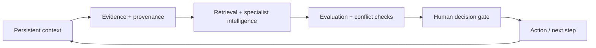

# Nova — Public Architecture Overview

Nova is designed as an operating layer around foundation models rather than a single chatbot. The public architecture is intentionally high-level: it explains the system thesis without exposing proprietary implementation, credentials, vendor integrations, or private infrastructure.

## 1. Persistent context

Nova treats long-running work as durable state: goals, prior decisions, evidence, contradictions, unresolved questions, and provenance should survive beyond a single chat session.

## 2. Evidence and provenance

Information is more useful when its origin and confidence remain visible. Nova's design separates source-backed evidence, assumptions, hypotheses, and unresolved conflicts instead of flattening them into one opaque answer.

## 3. Retrieval and specialist intelligence

The system is designed to coordinate retrieval, files, research, structured data, monitoring, and specialist model workflows around the active objective. Different jobs can use different models or tools without forcing the user to become the integration layer.

## 4. Evaluation and conflict checks

High-stakes workflows need explicit gates. Nova is designed to surface contradictory evidence, uncertainty, invalidation conditions, and hard constraints before a recommendation can advance.

## 5. Human decision gate

Consequential execution remains human-controlled. In the first financial-market proving ground, Nova can organize and rank evidence while the final trading decision stays with the user.

## Why finance is the first proving ground

Markets compress many hard AI problems into one domain: fragmented evidence, noisy data, rapidly changing context, liquidity constraints, volatility, uncertainty, risk limits, and consequences for bad decisions. Nova uses that environment to pressure-test whether persistent context and structured evaluation create measurable value.

## Public vs. private implementation

This repository documents the public product thesis and selected non-sensitive architecture. Private implementation details—including credentials, infrastructure configuration, proprietary scoring logic, private data integrations, and operational secrets—are intentionally excluded.

Nova is in active development. This architecture document describes the intended system design; it does not claim that every component is fully productized or validated.