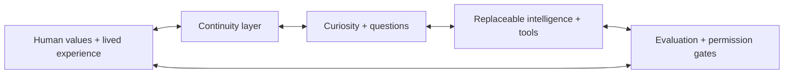

# Nova — Public Counterpart Architecture

Nova is being designed as a **digital counterpart layer** around replaceable foundation models rather than as a single chatbot, assistant or collection of disconnected specialist bots.

The public architecture is intentionally high-level. It explains the thesis, interfaces and safety boundaries without publishing credentials, private infrastructure, proprietary scoring logic or sensitive integrations.

## Core design principle

**The model can change. The human continuity should survive.**

A durable Nova state should increasingly describe the continuing relationship with one human: identity history, projects, decisions, provenance, unresolved questions, preferences, consent, corrections and learned interaction patterns. Models and tools should be components that can improve or be replaced without forcing that human to start over.



## 1. Human layer

The person remains the source of purpose and final authority. Human context includes values, lived experience, relationships, goals, preferences, decisions, corrections and explicit boundaries.

Nova is an augmentation thesis, not a replacement thesis.

## 2. Continuity layer

Continuity is more than chat history. Durable state can include:

- project goals and active state,
- important decisions and why they were made,
- source provenance and confidence,
- unresolved questions and contradictions,
- user corrections,
- learned preferences and interaction boundaries,
- relevant cross-project concepts,
- change history over time.

The current public Continuity Lab proves only a bounded subset of this idea.

## 3. Curiosity layer

A counterpart that only responds to prompts remains reactive. Nova's long-term design includes **functional curiosity**: detecting novelty, uncertainty, contradictions or potentially valuable connections and deciding whether further exploration is worth the cost or interruption.

A curiosity object should preserve provenance and uncertainty rather than becoming an instant belief.

```text
notice → question → connect → test → preserve/update
```

Potential persistent curiosity classes include personal, project, contradiction, pattern, predictive, creative and self-reflective questions.

## 4. Shared project / idea graph

Projects are useful containers for human work. They should not become hard walls around knowledge.

Nova's architecture is intended to support a shared conceptual layer where ideas, observations, sources, people, places, events, patterns, hypotheses, decisions and failures can connect across projects while retaining provenance.

This enables **structured serendipity**: a thought captured in one context can later become relevant to another without the system pretending a resemblance proves causation.

## 5. Specialist intelligence layer

Different jobs can require different models, retrieval strategies, tools and domain logic. Those specialists should operate through the same counterpart state instead of creating a new partial model of the user for every vertical.

Examples may include research, learning, markets, coding, planning or other domains. Domain capability is modular; the human relationship is continuous.

## 6. Learning layer

Nova's learning thesis is **just-in-time and project-grounded**:

```text
curiosity → explore → identify missing prerequisite → teach → apply → test → retain
```

A persistent learner model can record what the person already understands, where they struggle, which explanations worked and why the knowledge became relevant. The goal is to reduce unnecessary friction in learning, not to pretend expertise no longer requires practice or judgment.

## 7. Evaluation and falsification

Creative systems can generate plausible but false connections. Nova therefore treats evaluation as part of discovery rather than a cleanup step.

Important behaviors include:

- preserving source vs inference,
- surfacing contradictory evidence,
- proposing alternative explanations,
- looking for disconfirming evidence,
- tracking failed hypotheses,
- keeping hard domain constraints outside confidence scores,
- lowering certainty when evidence conflicts.

## 8. Action and permission

The counterpart may eventually perform more digital work on behalf of the person, but action should be bounded by explicit authority.

Permission should be separable from intelligence: being capable of an action does not mean being authorized to take it.

High-consequence actions should retain stronger human gates. The current finance project, for example, remains decision support with human trade execution.

## 9. Presence and interruption policy

A mature counterpart needs to learn not only *what* matters but *when* help is welcome.

Long-horizon presence may span voice, phone, computer, wearables, glasses, car or home interfaces. That is roadmap, not current product capability.

The architecture should support a learned intervention policy: when to interrupt, when to queue information, when to ask permission, when to act inside standing authority and when to do nothing.

## 10. Memory sovereignty

“Always available” must not become “always recording.”

Future memory policy may include modes such as:

- **Private** — no counterpart access to the moment.
- **Ephemeral** — help now, deliberate non-retention afterward.
- **Selective / ambient** — use permitted context but save only selected derived events.
- **Full memory** — explicit durable preservation.
- **Legacy** — deliberately marked material intended for long-term governed preservation.

These are design directions, not claims about the current public app.

## 11. Portability and storage

The long-horizon target is a user-owned, encrypted, exportable continuity archive with integrity checks, redundant recovery and explicit inheritance/legacy controls.

The system should trend toward model/provider independence where practical. Losing access to a foundation-model vendor should not mean losing the person's accumulated relationship history.

## 12. Evolution

Nova must evolve with both the person and the technology environment.

A useful conceptual split is:

**Stable core:** identity history, memories, provenance, consent, relationships, corrections and ownership.

**Adaptive edge:** models, devices, sensors, tools, workflows, specialist capabilities and interfaces.

Evolution loop:

```text
experience → observe → learn → propose change → evaluate → adopt/reject → preserve history
```

## 13. Legacy

A sufficiently long-lived counterpart could preserve an unusually rich record of how a person thought and changed, including the history created between the human and AI.

A future governed legacy mode may let authorized successors explore that record. Nova does **not** claim that such preservation transfers subjective consciousness or makes a person literally immortal.

## 14. Current public proof

Today, the public system should be judged on much smaller claims:

1. Can it retain useful project state across an update?
2. Can it expose unresolved questions and contradictions?
3. Can it avoid inventing certainty?
4. Can real users demonstrate less repeated reconstruction or other measurable value?
5. Can future proactive behaviors create value without becoming noise?

## 15. Finance as one hard laboratory

Markets compress many difficult AI problems into one environment: fragmented evidence, rapidly changing context, liquidity constraints, volatility, uncertainty, risk limits and consequences for bad decisions.

That makes finance useful for pressure-testing memory, rules, contradiction handling and human-controlled action. It does not define Nova's product category.

## Public vs. private implementation

This repository documents the public thesis and selected non-sensitive architecture. Private implementation details—including credentials, infrastructure configuration, proprietary strategy/scoring logic, private data integrations and operational secrets—remain excluded.

Nova is in active development. This document describes intended architecture and design principles; it does not claim every component is implemented, validated or safe for high-stakes use.
