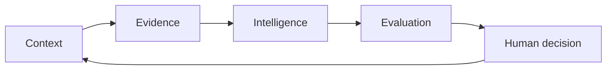

# Nova

**AI that remembers. Intelligence that compounds.**

Nova is a founder-built persistent AI system designed to carry context, evidence, tools, research, and decisions across long-running work instead of making the user reconstruct everything every session.

Finance is Nova's first hard proving ground because it forces the system to operate around noisy evidence, explicit risk, conflicting signals, structured data, and human accountability at the same time.

> **Current focus:** prove that persistent continuity reduces repeated work and improves decision consistency for real users before widening the market.

## What Nova is building

- **Persistent context** — project goals, decisions, evidence, contradictions, and unresolved questions remain part of the working state.
- **Tool and research orchestration** — files, research, monitoring, structured data, and specialist workflows are coordinated around the user's objective.
- **Evidence-aware reasoning** — assumptions, conflicts, and uncertainty stay visible instead of disappearing behind a score.
- **Human-controlled decisions** — Nova is designed to organize and rank evidence while keeping consequential execution under human control.

## System thesis

See [ARCHITECTURE.md](ARCHITECTURE.md) for the public system overview and [ROADMAP.md](ROADMAP.md) for the proof-first development sequence.

## Why finance first

Financial markets are a demanding environment for persistent AI. Useful context is fragmented across market data, options structure, liquidity, volatility, regime, research, risk rules, and execution constraints. Nova uses that environment to pressure-test whether continuity and domain intelligence can reduce fragmentation into clearer decisions.

Nova does **not** claim guaranteed returns, proven alpha, autonomous trading, or product-market fit.

## Current stage

| Layer | Status |
| --- | --- |
| Persistent knowledge architecture | **Defined** |
| Financial/options decision-support framework | **Built** |
| Public product + founder surface | **Live** |
| Source-aware lead and outreach funnel | **Live** |
| Measured real-user validation | **Next** |

The next proof point is measured design-partner validation: does persistent continuity reduce repeated work and improve decision consistency for real users?

## Founder

Nova is built by **Stephen McIntosh**, a solo founder with a background spanning business management, multi-location operations, sales, training, teaching, coaching, and systems building.

## Public project links

- Product / founder site: https://hello-stephen-mcintosh-gu2anp.v2.appdeploy.ai/
- Contact: stephen@commandnova.com
- Public architecture: [ARCHITECTURE.md](ARCHITECTURE.md)
- Public roadmap: [ROADMAP.md](ROADMAP.md)

## Repository purpose

This public repository is the clean public home for Nova's project overview, public-facing documentation, and selected non-sensitive materials. Proprietary implementation details, credentials, private infrastructure, data-vendor integrations, and operational secrets are intentionally not published here.

---

Nova is in active development. Nothing in this repository or the linked site is investment advice, a trading recommendation, a promise of performance, or an offer of securities.
