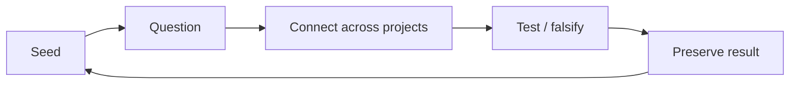
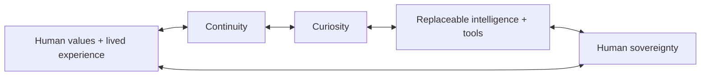

# Nova

**Life is continuous. Your AI should be too.**

Nova is a founder-built project exploring a different relationship with AI: not another assistant that waits for a prompt, but a **digital counterpart** designed to grow with the same human over time.

The long-term goal is a persistent, human-controlled intelligence that can preserve continuity, carry projects, develop useful curiosity, help the person learn and explore, and remain portable as models, tools and interfaces change.

> **The vision is intentionally larger than the current product.** The public proof today is a bounded Continuity Lab plus a deeper finance/options project used as one hard test environment. Ambient presence, lifetime memory, specialist life domains and deeper human–AI interfaces are roadmap—not current-product claims.

## Counterpart, not assistant

An assistant is something the user calls when they need a task completed. Nova's thesis is that the **human–AI relationship itself should become durable state**.

The human contributes lived experience, values, relationships, embodiment, purpose and final authority. Nova can contribute memory, synthesis, computation, research, pattern discovery, digital coordination and authorized action.

The goal is not to replace the person. It is to reduce avoidable cognitive and digital overhead so more of a finite human life can be spent living, creating, learning and exploring.

**The model should be replaceable. The relationship should not be.**

## Core faculties

- **Presence** — be available in the contexts the person chooses.
- **Memory** — preserve what matters, including why decisions were made and how they changed.
- **Curiosity** — notice uncertainty, contradictions, novelty and unexplored connections.
- **Learning** — teach at the point of need and retain a changing learner model.
- **Reasoning** — connect evidence while keeping assumptions and uncertainty visible.
- **Prediction** — anticipate likely needs without pretending certainty.
- **Action** — perform permitted digital work while preserving human gates where consequences demand them.
- **Reflection** — learn from outcomes, mistakes and ignored or unhelpful interventions.
- **Evolution** — adopt better models, tools and behaviors without erasing identity history.
- **Protection** — keep consent, privacy, ownership and human sovereignty central.
- **Legacy** — preserve a governed record of the person and the shared relationship without claiming consciousness transfer.

## Projects are exploration environments

Stocks/options are **not Nova**. They are one project inside Nova.

The same counterpart can explore markets, research, history, code, product design or another domain without becoming a different bot each time. Projects give work focus; a shared conceptual layer lets useful ideas cross project boundaries.

The learning loop is:

```text
curiosity → explore → learn what is needed → apply → test → correct → go deeper
```

The principle is simple: **curiosity becomes the curriculum**. Nova should remove waste between curiosity and capability without pretending practice, judgment, physical skill or professional responsibility can be skipped.

## Curiosity and serendipity

A counterpart that only answers prompts is still reactive.

Nova's design treats random thoughts, unanswered questions and contradictions as durable **seeds**. A seed can remain unresolved until new evidence, a new project or a future experience makes it useful.



Creative association is not evidence. The system should be willing to generate daring hypotheses and equally willing to attack them with controls, conflicting evidence and alternative explanations.

## Public architecture



See [ARCHITECTURE.md](ARCHITECTURE.md) for the public system thesis and [ROADMAP.md](ROADMAP.md) for the proof-first path from today's continuity experiment toward a broader counterpart.

## What exists today

| Layer | Status |
| --- | --- |
| Public no-signup Continuity Lab | **Live** |
| Financial/options decision-support project | **Built** |
| Digital-counterpart architecture | **Defined** |
| Public founder/product and source-aware outreach surface | **Live** |
| Measured external design-partner validation | **Next** |

The next critical proof is not whether people like the futuristic vision. It is whether persistent continuity plus one counterpart-specific behavior—such as cross-project recall, seed capture or a persistent question queue—creates measurable value in real work without increasing noise.

## Finance is one laboratory

Financial markets are useful because forgotten constraints, conflicting evidence and overconfidence are punished quickly. Nova's finance project uses that environment to test persistent rules, specialist intelligence, explicit risk gates and human-controlled execution.

Nova does **not** claim guaranteed returns, proven alpha or autonomous trading.

## Human sovereignty

“Always there” must never automatically mean “always recording.” A lifetime counterpart only works if the person can control presence, retention and action.

Long-horizon design questions include private/ephemeral modes, selective memory, portable encrypted archives, deletion/correction, model independence and governed legacy access.

## Founder

Nova is built by **Stephen McIntosh**, a solo founder whose path spans University of Louisville business education, multi-location operations, sales/training, special-education teaching/coaching and hands-on systems building.

That path is nontraditional for an AI founder. It is also closely tied to the problem Nova is trying to solve: coordinate moving parts, teach what is needed next, adapt to the person, preserve why decisions were made and keep responsibility visible.

## Public links

- Product / founder site: https://hello-stephen-mcintosh-gu2anp.v2.appdeploy.ai/
- Contact: stephen@commandnova.com
- Public architecture: [ARCHITECTURE.md](ARCHITECTURE.md)
- Public roadmap: [ROADMAP.md](ROADMAP.md)

## Repository purpose

This public repository is the clean public home for Nova's thesis, public-facing architecture, roadmap and selected non-sensitive materials. Proprietary implementation details, credentials, private infrastructure, data-vendor integrations and operational secrets are intentionally excluded.

---

Nova is in active development. Broader ambient, health, legacy and human-interface concepts are roadmap. Nothing in this repository or the linked site is medical care, therapy, investment advice, a trading recommendation, a promise of performance or an offer of securities.
